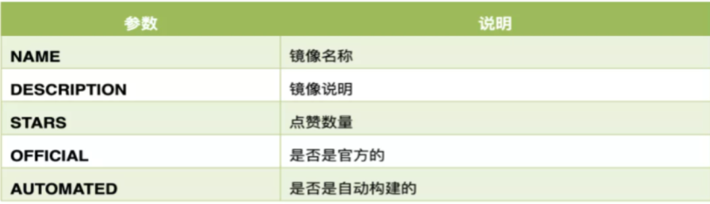
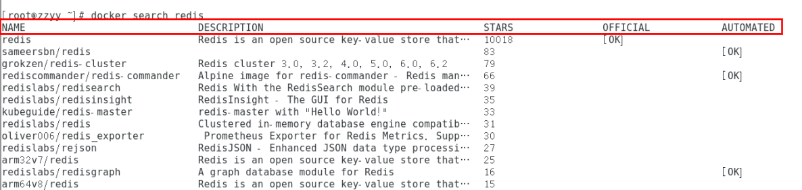
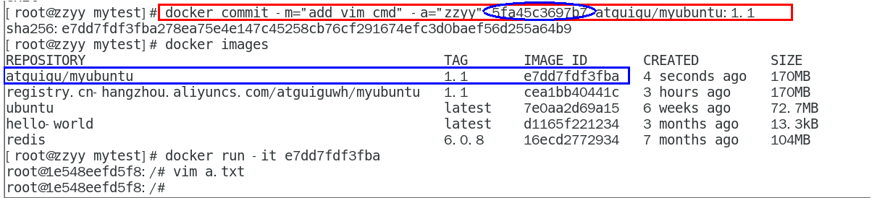
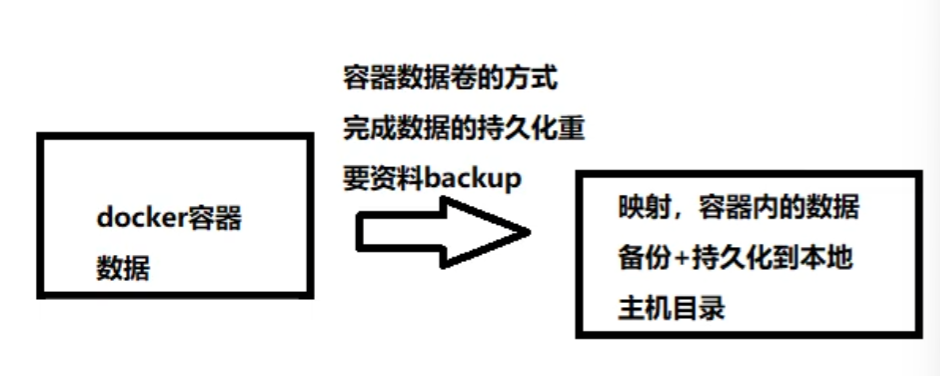
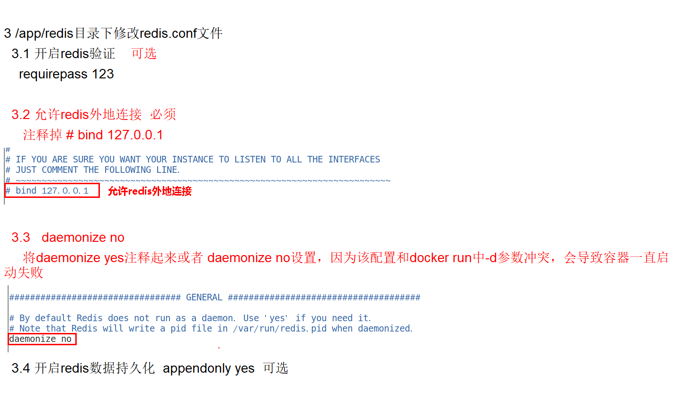

### Docker

#### 一、Docker简介

#####1.1 Docker为什么要出现？

​	Docker是一种能实现**系统平滑移植，容器虚拟化**的技术。

​	环境配置相当麻烦，换一台机器，就要重来一次，费力费时。很多人想到，能不能从根本上解决问题，软件可以带环境安装？也就是说，**安装的时候，把原始环境一模一样地复制过来。开发人员利用 Docker 可以消除协作编码时“在我的机器上可正常工作”的问题**。

 ##### 1.2 Docker的理念

1. Docker是基于Go语言实现的云开源项目。
2. 通过对应用组件的封装、分发、部署、运行等生命周期的管理，使用户的APP（可以是一个WEB应用或数据库应用等等）及其运行环境能够做到“**一次镜像，处处运行**”。
3. Linux容器技术的出现就解决了这样一个问题，而 Docker 就是在它的基础上发展过来的。将应用打成镜像，通过镜像成为运行在Docker容器上面的实例，而 Docker容器在任何操作系统上都是一致的，这就实现了跨平台、跨服务器。只需要一次配置好环境，换到别的机子上就可以一键部署好，大大简化了操作。

#####1.3 总结

​	解决了运行环境和配置问题的软件容器，方便做持续集成并有助于整体发布的容器虚拟化技术。

#### 二、虚拟机和容器的对比

#####2.1 传统的虚拟机技术

1. 虚拟机（virtual machine）就是带环境安装的一种解决方案。
   它可以在一种操作系统里面运行另一种操作系统，比如在Windows10系统里面运行Linux系统CentOS7。应用程序对此毫无感知，因为虚拟机看上去跟真实系统一模一样，而对于底层系统来说，虚拟机就是一个普通文件，不需要了就删掉，对其他部分毫无影响。这类虚拟机完美的运行了另一套系统，能够使应用程序，操作系统和硬件三者之间的逻辑不变。  
2. **缺点**：资源占用多、冗余步骤多、启动慢

#####2.2 容器虚拟化技术

1. Linux容器是与系统其他部分隔离开的一系列进程，从另一个镜像运行，并由该镜像提供支持进程所需的全部文件。容器提供的镜像包含了应用的所有依赖项，因而在从开发到测试再到生产的整个过程中，它都具有可移植性和一致性。
2. Docker容器是在操作系统层面上实现虚拟化，直接复用本地主机的操作系统，而传统虚拟机则是在硬件层面实现虚拟化。与传统的虚拟机相比，Docker 优势体现为启动速度快、占用体积小。
3. **Linux 容器不是模拟一个完整的操作系统而是对进程进行隔离**。有了容器，就可以**将软件运行所需的所有资源打包到一个隔离的容器中**。容器与虚拟机不同，不需要捆绑一整套操作系统，只需要软件工作所需的库资源和设置。系统因此而变得高效轻量并保证部署在任何环境中的软件都能始终如一地运行。

#####2.3 虚拟机和容器的不同

1. 传统虚拟机技术是虚拟出一套硬件后，在其上运行一个完整操作系统，在该系统上再运行所需应用进程；
2. 容器内的应用进程直接运行于宿主的内核，容器内没有自己的内核**且也没有进行硬件虚拟**。因此容器要比传统虚拟机更为轻便。
3. 每个容器之间互相隔离，每个容器有自己的文件系统 ，容器之间进程不会相互影响，能区分计算资源。

#### 三、Docker的安装

#####3.1 Docker的基本组成

1. 镜像：Docker 镜像（Image）就是一个**只读**的模板。镜像可以用来创建 Docker 容器，**一个镜像可以创建很多容器**。docker镜像文件类似于Java的类模板，而docker容器实例类似于java中new出来的实例对象。

2. 容器：

   ​	从面向对象角度：
   ​		Docker 利用容器（Container）独立运行的一个或一组应用，应用程序或服务运行在容器里面，容器就类似于一个虚拟化的运行环境，**容器是用镜像创建的运行实例**。就像是Java中的类和实例对象一样，镜像是静态的定义，容器是镜像运行时的实体。容器为镜像提供了一个标准的和隔离的运行环境，它可以被启动、开始、停止、删除。每个容器都是相互隔离的、保证安全的平台

   ​	 从镜像容器角度：
   ​		可以把容器看做是一个简易版的 Linux 环境（包括root用户权限、进程空间、用户空间和网络空间等）和运行在其中的应用程序。

3. 仓库：仓库（Repository）是集中存放镜像文件的场所。类似于Maven仓库，存放各种jar包的地方

##### 3.2 安装

1. 查看CentOS版本(7以上) 

   ```shell
   cat /etc/redhat-release
   ```

2. 卸载旧版本

   ```shell
   sudo yum remove docker \
                     docker-client \
                     docker-client-latest \
                     docker-common \
                     docker-latest \
                     docker-latest-logrotate \
                     docker-logrotate \
                     docker-engine
   ```

3. yum安装gcc相关

   ```shell
   yum -y install gcc
   yum -y install gcc-c++
   ```

4. 安装需要的软件包

   ```shell
   yum install -y yum-utils
   ```

5. 设置stable镜像仓库

   ```shell
   yum-config-manager --add-repo http://mirrors.aliyun.com/docker-ce/linux/centos/docker-ce.repo
   ```

6. 更新yum软件包索引

   ```shell
   yum makecache fast
   ```

7. 安装DOCKER CE

   ```shell
   yum -y install docker-ce docker-ce-cli containerd.io
   ```

8. 启动docker

   ```shell
   systemctl start docker
   ```

9. 检查

   ```shell
   docker version
   docker run hello-world
   ```

10. 卸载

    ```shell
    systemctl stop docker 
    yum remove docker-ce docker-ce-cli containerd.io
    rm -rf /var/lib/docker
    rm -rf /var/lib/containerd
    ```

##### 3.3 配置镜像加速器

​	阿里云-->镜像加速器

```shell
sudo mkdir -p /etc/docker
sudo tee /etc/docker/daemon.json <<-'EOF'
{
  "registry-mirrors": ["https://y337naz4.mirror.aliyuncs.com"]
}
EOF
sudo systemctl daemon-reload
sudo systemctl restart docker
```

#### 四、Docker常用命令

##### 4.1 帮助启动类命令

```shell
启动docker： systemctl start docker
停止docker： systemctl stop docker
重启docker： systemctl restart docker
查看docker状态： systemctl status docker
开机启动： systemctl enable docker
查看docker概要信息： docker info
查看docker总体帮助文档： docker --help
查看docker命令帮助文档： docker 具体命令 --help
```

##### 4.2 镜像命令

```shell
docker images 列出本地主机上的镜像
docker search 某个XXX镜像名字
docker pull 某个XXX镜像名字  下载镜像【没有TAG就是最新版】，例如docker pull redis:6.0.8
docker system df 查看镜像/容器/数据卷所占的空间
docker rmi 某个XXX镜像名字ID  删除镜像
```





##### 4.3 引申：谈谈什么是虚悬镜像？

+ 仓库名、标签都是<none>的镜像，俗称虚悬镜像dangling image

 [虚悬镜像.wmf](虚悬镜像.wmf) 

##### 4.4 容器命令

1. 启动容器

   ```shell
   docker run IMAGE   例如：docker run -it centos /bin/bash
   参数：
   --name="容器新名字"       为容器指定一个名称；
   -d: 后台运行容器并返回容器ID，也即启动守护式容器(后台运行)；
    
   -i：以交互模式运行容器，通常与 -t 同时使用；
   -t：为容器重新分配一个伪输入终端，通常与 -i 同时使用；
   也即启动交互式容器(前台有伪终端，等待交互)；
    
   -P: 随机端口映射，大写P
   -p: 指定端口映射，小写p(常用)，例如：-p 8080:6379 前一个是docker端口，后面是docker映射redis端口
   /bin/bash：放在镜像名后的是命令，这里我们希望有个交互式 Shell，因此用的是 /bin/bash。
   要退出终端，直接输入 exit:
   ```

2. 列出正在运行的容器

   ```shell
   docker ps
   ```

3. 退出容器

   ```shell
   exit	run进去容器，exit退出，容器停止
   ctrl+p+q	run进去容器，ctrl+p+q退出，容器不停止
   ```

4. 启动已停止运行的容器

   ```shell
   docker start 容器ID或者容器名
   ```

5. 重启容器

   ```shell
   docker restart 容器ID或者容器名
   ```

6. 停止容器

   ```shell
   docker stop 容器ID或者容器名
   ```

7. 强制停止容器

   ```shell
   docker kill 容器ID或容器名
   ```

8. 删除已停止的容器

   ```shell
   docker rm 容器ID
   一次性删除多个容器实例
   docker rm -f $(docker ps -a -q)
   docker ps -a -q | xargs docker rm
   ```

9. 重要命令

   ```shell
   docker run -d 容器名	启动守护式容器(后台服务器)
   前台交互式启动		docker run -it redis:6.0.8
   后台守护式启动		docker run -d redis:6.0.8
   docker logs 容器ID	查看容器日志
   docker top 容器ID		查看容器内运行的进程
   docker inspect 容器ID	查看容器内部细节
   重新进入容器命令(2条)
   docker exec -it 容器ID bashShell  (推荐)
   docker attach 容器ID
   区别：exec 是在容器中打开新的终端，并且可以启动新的进程，用exit退出，不会导致容器的停止。
   	attach 直接进入容器启动命令的终端，不会启动新的进程，用exit退出，会导致容器的停止。
   docker cp  容器ID:容器内路径 目的主机路径      从容器内拷贝文件到主机上
   docker export 容器ID > 文件名.tar    容器导出
   cat 文件名.tar | docker import - 镜像用户/镜像名:镜像版本号    容器导入
   ```
   

####五、Docker镜像

1. docker commit提交容器副本使之成为一个新的镜像

   ```shell
   docker commit -m="提交的描述信息" -a="作者" 容器ID 要创建的目标镜像名:[标签名]
   ```

   

2. 本地镜像发布到阿里云

   见阿里云官网

3. 本地镜像发布到私有库流程

   ```shell
   1、下载镜像Docker Registry	docker pull registry
   2、运行私有库	docker run -d -p 5000:5000  -v /zzyyuse/myregistry/:/tmp/registry --privileged=true registry
   	默认情况，仓库被创建在容器的/var/lib/registry目录下，建议自行用容器卷映射，方便于宿主机联调
   3、curl验证私服库上有什么镜像	url -XGET http://192.168.111.162:5000/v2/_catalog	ip是宿主机的ip
   4、将新镜像修改为符合私服规范的Tag	docker tag 镜像:Tag Host:Port/Repository:Tag
   	例如：docker tag  zzyyubuntu:1.2  192.168.111.162:5000/zzyyubuntu:1.2
   5、vim /etc/docker/daemon.json 修改docker的配置文件 "insecure-registries": ["192.168.111.162:5000"] 记得json格式有逗号，docker默认不支持http推送，修改配置后需要重启
   6、推送到私服库	docker push 192.168.111.162:5000/zzyyubuntu:1.2
   7、curl验证私服库上有什么镜像	curl -XGET http://192.168.111.162:5000/v2/_catalog
   8、pull到本地并运行	docker pull 192.168.111.162:5000/zzyyubuntu:1.2
   					docker run -it 镜像ID /bin/bash
   ```

#### 六、Docker容器数据卷

#####6.1【坑】容器卷记得加入--privileged=true

 Docker挂载主机目录访问**如果出现cannot open directory .: Permission denied**
解决办法：在挂载目录后多加一个--privileged=true参数即可，因为CentOS7的安全模块可能不允许

#####6.2 容器卷是什么？



​	卷就是目录或文件，存在于一个或多个容器中，由docker挂载到容器，但不属于联合文件系统，因此能够绕过Union File System提供一些用于持续存储或共享数据的特性：
​	卷的设计目的就是数据的持久化，完全独立于容器的生存周期，因此Docker不会在容器删除时删除其挂载的数据卷。一句话：有点类似我们Redis里面的rdb和aof文件；将docker容器内的数据保存进宿主机的磁盘中

```shell
运行一个带有容器卷存储功能的容器实例
docker run -it --privileged=true -v /宿主机绝对路径目录:/容器内目录 镜像名
```

##### 6.3 容器卷能干什么？

*  将运用与运行的环境打包镜像，run后形成容器实例运行 ，但是我们对数据的要求希望是持久化的，Docker容器产生的数据，如果不备份，那么当容器实例删除后，容器内的数据自然也就没有了。
   为了能保存数据在docker中我们使用卷。

特点：
1：数据卷可在容器之间共享或重用数据
2：卷中的更改可以直接实时生效，爽
3：数据卷中的更改不会包含在镜像的更新中
4：数据卷的生命周期一直持续到没有容器使用它为止

##### 6.4 数据卷案例

1. 宿主vs容器之间映射添加容器卷

   + 命令

     ```shell
     docker run -it --privileged=true -v /宿主机绝对路径目录:/容器内目录 镜像名
     ```

   + 查看数据卷是否挂载成功

     ```shell
     docker inspect 容器ID
     ```

   + 容器和宿主机之间数据共享

     1  docker修改，主机同步获得 
     2 主机修改，docker同步获得
     3 docker容器stop，主机修改，docker容器重启看数据是否同步。**是同步的**

2. 读写规则映射添加说明

   +  docker run -it --privileged=true -v /宿主机绝对路径目录:/容器内目录:rw 镜像名，默认就是rw
   +  docker run -it --privileged=true -v /宿主机绝对路径目录:/容器内目录:ro 镜像名，就能完成功能，此时容器自己只能读取不能写，ro = read only，此时如果宿主机写入内容，可以同步给容器内，容器可以读取到。

3. 卷的继承和共享

   + docker run -it  --privileged=true --volumes-from 父类  --name u2 ubuntu
   + 容器1完成和宿主机的映射；容器2继承容器1的卷规则

#### 七、Docker常规安装

##### 7.1 总体步骤

- [ ] 搜索镜像
- [ ] 拉取镜像
- [ ] 查看镜像
- [ ] 启动镜像--服务端口映射
- [ ] 停止容器
- [ ] 移除容器

##### 7.2 安装tomcat

1. **docker hub上面查找tomcat镜像**    docker search tomcat
2. **从docker hub上拉取tomcat镜像到本地**    docker pull tomcat
3. **docker images查看是否有拉取到的tomcat**    docker images tomcat
4. **使用tomcat镜像创建容器实例(也叫运行镜像)**    docker run -it -p 8080:8080 tomcat
   - [ ] -p 小写，主机端口:docker容器端口
   - [ ] -P 大写，随机分配端口
   - [ ] i:交互
   - [ ] t:终端
   - [ ] d:后台
5. 访问tomcat首页
   - [ ] 可能没有映射端口或者没有关闭防火墙
   - [ ] 把webapps.dist目录换成webapps
6. 免修改版本说明
   - [ ] docker pull billygoo/tomcat8-jdk8
   - [ ] docker run -d -p 8080:8080 --name mytomcat8 billygoo/tomcat8-jdk8

#####7.3 安装mysql

1. docker search mysql

2.  docker pull mysql:5.7

3. 简单版

   + 使用mysql镜像    docker run -p 3306:3306 -e MYSQL_ROOT_PASSWORD=123456 -d mysql:5.7
   + docker ps
   + docker exec -it 容器ID /bin/bash
   + mysql -uroot -p
   + **注意**：linux主机上已经启动的的mysql服务可能已经占用了3306端口
   + docker上默认字符集编码隐患；

4. **复杂版**  docker run -d -p 3306:3306 --privileged=true 

   -v /zzyyuse/mysql/log:/var/log/mysql 

   -v /zzyyuse/mysql/data:/var/lib/mysql 

   -v /zzyyuse/mysql/conf:/etc/mysql/conf.d 

   -e MYSQL_ROOT_PASSWORD=123456  --name mysql mysql:5.7

5. 在主机的挂载目录新建my.cnf，解决中文乱码

   ```shell
   [client]
   default_character_set=utf8
   [mysqld]
   collation_server = utf8_general_ci
   character_set_server = utf8
   ```

##### 7.4 安装redis

1. 从docker hub上(阿里云加速器)拉取redis镜像到本地标签为6.0.8    docker pull redis:6.0.8

2. 启动    docker run -d -p 6379:6379 redis:6.0.8

   ​			docker exec -it f216c38ea035 /bin/bash

3. 命令提醒：容器卷记得加入--privileged=true

4. 在CentOS宿主机下新建目录/app/redis    mkdir -p /app/redis

5. 将一个redis.conf文件模板拷贝进/app/redis目录下    cp /myredis/redis.conf /app/redis/

6. 配置redis配置文件

   

7. 使用redis6.0.8镜像创建容器(也叫运行镜像)

   docker run  -p 6379:6379 --name myr3 --privileged=true 

   -v /app/redis/redis.conf:/etc/redis/redis.conf 

   -v /app/redis/data:/data 

   -d redis:6.0.8 redis-server /etc/redis/redis.conf

#### 八、Docker轻量级可视化工具Portainer

#####8.1 Portainer是什么？

​	Portainer 是一款轻量级的应用，它提供了图形化界面，用于方便地管理Docker环境，包括单机环境和集群环境。

##### 8.2 安装

1. docker run -d -p 8000:8000 -p 9000:9000 --name portainer     --restart=always     -v /var/run/docker.sock:/var/run/docker.sock     -v portainer_data:/data     portainer/portainer
2. 第一次登录需创建admin，访问地址：xxx.xxx.xxx.xxx:9000
3. 选择local选项卡后本地docker详细信息展示

